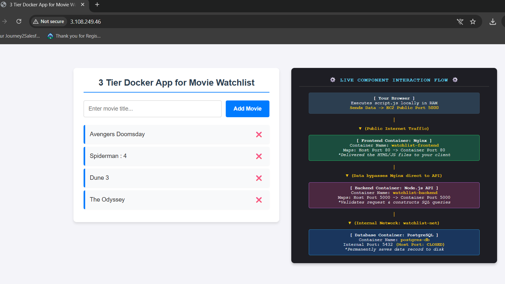
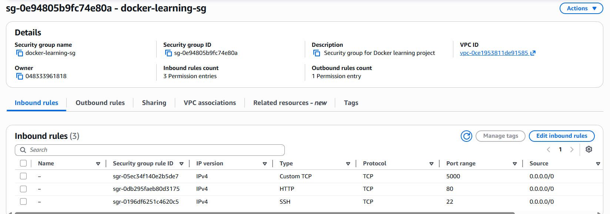
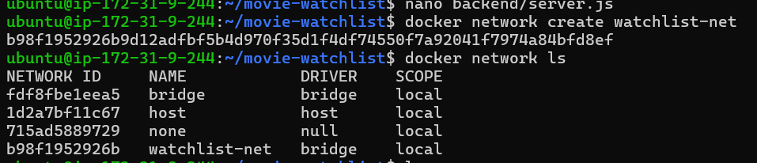
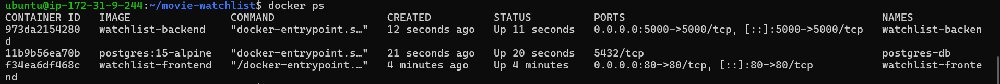

# 🎬 3-Tier Docker App: Movie Watchlist

A lightweight, modern **Three-Tier Movie Watchlist application** containerized with Docker and deployed on an AWS EC2 instance. This project serves as an interactive sandbox designed to demonstrate and visualize multi-container isolated networking, client-to-server request life cycles, and secure database configurations.

<p align="center">
  
</p>

---

## 🗺️ System Architecture & Workflow

The workspace features a responsive **split-window layout**: the left panel handles live user interactions (CRUD operations), while the right panel embeds a live architectural blueprint mapping out the infrastructure.

### The Request Lifecycle

1. **Deliver Assets:** The user requests the UI via HTTP (**Port 80**). The Nginx container (`watchlist-frontend`) serves the static `index.html` and `script.js` files straight to the client browser.
2. **Execute Locally:** The JavaScript files execute locally inside the user's browser RAM, completely outside of the Docker daemon environment.
3. **API Requests:** When a user interacts with the app, the local browser targets the Node.js API directly across the public internet on **Port 5000**.
4. **Isolated Database Transaction:** The Node.js container (`watchlist-backend`) receives the data and passes a SQL command over a custom, private virtual network (`watchlist-net`) to the PostgreSQL container (`postgres-db`) on internal **Port 5432**.

---
### 🔀 Network Flow Diagram

```
                        ┌─────────────────────────────────────────────────────────────┐
                        │                   ☁️  AWS EC2 Instance                      │
                        │                                                             │
  👤 User Browser       │   📦 watchlist-frontend        📦 watchlist-backend        │
  (Public Internet)     │      nginx:alpine                 node:20-alpine            │
                        │      [Custom Build]               [Custom Build]            │
  ── ① HTTP :80 ──────────────────────►│                         │                   │
  ◄─ ② Serves HTML/JS ─────────────────│                         │                   │
                        │               │  (JS now runs locally   │                   │
                        │               │   in browser RAM)       │                   │
                        │                                         │                   │
  ── ③ API Call :5000 ──────────────────────────────────────────►│                   │
                        │                                         │                   │
                        │               ╔═════════════════════════╪═══════════════╗   │
                        │               ║   🔒 watchlist-net      │               ║   │
                        │               ║   (Private Bridge)      │               ║   │
                        │               ║                         ▼               ║   │
                        │               ║              📦 postgres-db             ║   │
                        │               ║              postgres:15-alpine         ║   │
                        │               ║         ④ SQL over :5432 (internal)    ║   │
                        │               ║           [No host port exposed]        ║   │
                        │               ╚════════════════════════════════════════╝   │
                        └─────────────────────────────────────────────────────────────┘

  ①  Browser requests UI assets over public HTTP (Port 80)
  ②  Nginx serves static index.html + script.js — one-time delivery
  ③  Every user action (add/delete/fetch) hits the Node.js API directly (Port 5000)
  ④  Backend forwards SQL commands to PostgreSQL over the private Docker bridge only
```

> 💡 **Note:** After the initial page load, the frontend container is out of the picture. All data flow runs directly between the user's browser and the backend API.

---


## ⚙️ Component Matrix & Network Blueprint

| Tier Component | Container Name | Image Source | Host Port (EC2 Public) | Internal Docker Network |
| :--- | :--- | :--- | :--- | :--- |
| **Frontend UI** | `watchlist-frontend` | Custom Build (`nginx:alpine`) | `80` (Standard HTTP) | No (Bypasses to Browser) |
| **Backend API** | `watchlist-backend` | Custom Build (`node:20-alpine`) | `5000` (Express API) | **YES** (`watchlist-net`) |
| **Database Vault** | `postgres-db` | Official Hub Image (`postgres:15-alpine`) | *None* (**Strictly Closed**) | **YES** (`watchlist-net`) |

> 🔒 **Security Best Practice:** The database container does not map any host ports. Because its host ports are closed, it is completely hidden from external internet scanning arrays and can only be reached by the backend API through the isolated bridge highway.

---

## 🛡️ Required AWS Firewall Configurations

For the application to accept traffic properly, your EC2 Instance's **Inbound Security Group Rules** must map the exposed application ports.

- Port 22 (SSH):** Open to your personal IP (For terminal administration).
- Port 80 (HTTP):** Open to `0.0.0.0/0` (Allows clients to load the interface).
- Port 5000 (Custom TCP):** Open to `0.0.0.0/0` (Allows client-side JS to process actions against the API).
- Port 5432 (PostgreSQL):** **Keep completely closed.** Docker manages this communication path internally.

<p align="center">
  
</p>

---

## 🚀 Step-by-Step Standalone Deployment

Follow these exact execution steps to build, network, and spin up the complete application stack from a fresh clone.

### Step 1: Initialize the Isolated Highway Network

Before spinning up containers, initialize the custom bridge network router so the backend can discover the database:

```bash
docker network create watchlist-net
docker network ls
```
<p align="center">
  
</p>

### Step 2: Build the Custom Application Images

Compile the local backend application logic and frontend Nginx configuration blueprints into local immutable Docker images:

```bash
# Build Backend Engine
docker build -t watchlist-backend backend/

# Build Frontend Web Engine
docker build -t watchlist-frontend frontend/
```

### Step 3: Launch the Database Foundation Vault

Spin up the PostgreSQL data engine. We feed our authentication keys safely through an environment file wrapper without exposing port 5432 to the host:

> 📦 **No build step needed here.** Unlike the frontend and backend, `postgres-db` uses the **official `postgres:15-alpine` image pulled directly from Docker Hub** — there is no custom code to compile. Docker will automatically pull it on first run if not already cached locally.

```bash
docker run -d \
  --name postgres-db \
  --network watchlist-net \
  --env-file db/.env \
  postgres:15-alpine
```

### Step 4: Deploy the App Components (API & UI)

> ⏱️ Wait ~5 seconds after starting the database to let Postgres finish running internal file initializations before kicking off the backend.

```bash
# Launch the Node.js API Middleware
docker run -d \
  --name watchlist-backend \
  --network watchlist-net \
  -p 5000:5000 \
  watchlist-backend

# Launch the static Nginx file delivery truck
docker run -d \
  --name watchlist-frontend \
  -p 80:80 \
  watchlist-frontend
```
- network watchlist-net on backend only: The backend needs to talk to the postgres-db container, which lives inside the private watchlist-net bridge. The frontend never talks to the database — it just serves static files to the browser — so it has no reason to join that network.

- 5000:5000 and -p 80:80: Format is HOST_PORT:CONTAINER_PORT. This punches a hole in the EC2 firewall and maps external traffic arriving on the host port to the container's internal port. So :80 on your EC2 IP forwards into Nginx, and :5000 forwards into Node.js — without this flag, those containers are unreachable from outside.
---

## 🔍 Verification & Performance Diagnostic Checks

Run these validation commands on your host server to verify the operational state of the 3-tier matrix:


```bash
# Check runtime health across the cluster
docker ps
```
Expected output
<p align="center">
  
</p>
